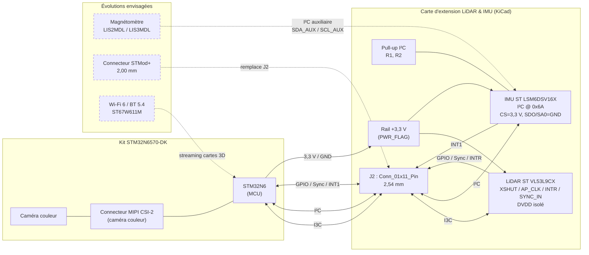

# Rapport de séance : Conception de la carte d'extension LiDAR & IMU

## 1. Travaux réalisés

### Choix de l'architecture d'interface
Sélection de la communication **I3C** pour le capteur LiDAR afin de libérer le connecteur **MIPI CSI-2** du kit STM32N6570-DK (dédié à la caméra couleur).

### Schématique sous KiCad

- **LiDAR ST VL53L9CX** : intégration du découplage d'alimentation, gestion des lignes de contrôle (`XSHUT`, `AP_CLK`, `INTR`, `SYNC_IN`) et isolation du LDO interne (`DVDD`).
- **IMU ST LSM6DSV16X** : configuration en mode I²C (adresse `0x6A` avec `CS` à +3,3 V et `SDO/SA0` à GND), ajout des résistances de pull-up et routage de la broche d'interruption `INT1`.
- **Connecteur d'interface J2** : barrette de broches `Conn_01x11_Pin` (2,54 mm) regroupant le bus I3C, le bus I²C, les signaux GPIO/Sync, l'interruption IMU et le rail d'alimentation principal (3,3 V / GND).
- Ajuster les pull-up du bus I²C de 10 kΩ à 2,2 kΩ pour garantir la propreté des signaux à 400 kHz.

### Validation du schéma (ERC)
Résolution des erreurs de conflit d'alimentation à l'aide d'un symbole `PWR_FLAG` sur le rail +3.3V, et justification/exclusion des faux positifs liés aux pins de puissance internes des symboles.

## 2. Diagramme de la situation

> Les éléments en pointillés correspondent aux pistes d'amélioration, non encore intégrées.

## 3. Pistes d'amélioration (évolutions du hardware)

| Domaine | Composant concerné | Référence | Piste d'amélioration |
|---|---|---|---|
| Boussole / Cap | Magnétomètre 3 axes | ST LIS2MDL (ou LIS3MDL) | **Ajouter ce magnétomètre sur le bus I²C auxiliaire** (`SDA_AUX`/`SCL_AUX`) du LSM6DSV16X pour obtenir une centrale 9 axes complète et corriger la dérive en cap (Yaw) lors des scans 3D. **Quasi nécessaire pour la prise de mesure, dans le cas où le scan est porté à la main et n'est pas sur un rail fixe.** |
| Connectique | Connecteur mezzanine | STMod+ (ex : Samtec CLT-110-02-G-D) | Remplacer le header 2,54 mm par un connecteur STMod+ (2,00 mm) pour enficher directement la carte sur la carte de développement sans câbles volants. |
| Sans-fil | Coprocesseur Wi-Fi/BT | ST ST67W611M (carte X-NUCLEO-67W61M1) | Ajouter l'extension Wi-Fi 6 / Bluetooth 5.4 pour transmettre les cartes de profondeur 3D générées par le STM32N6 en streaming vers un hôte externe. |
